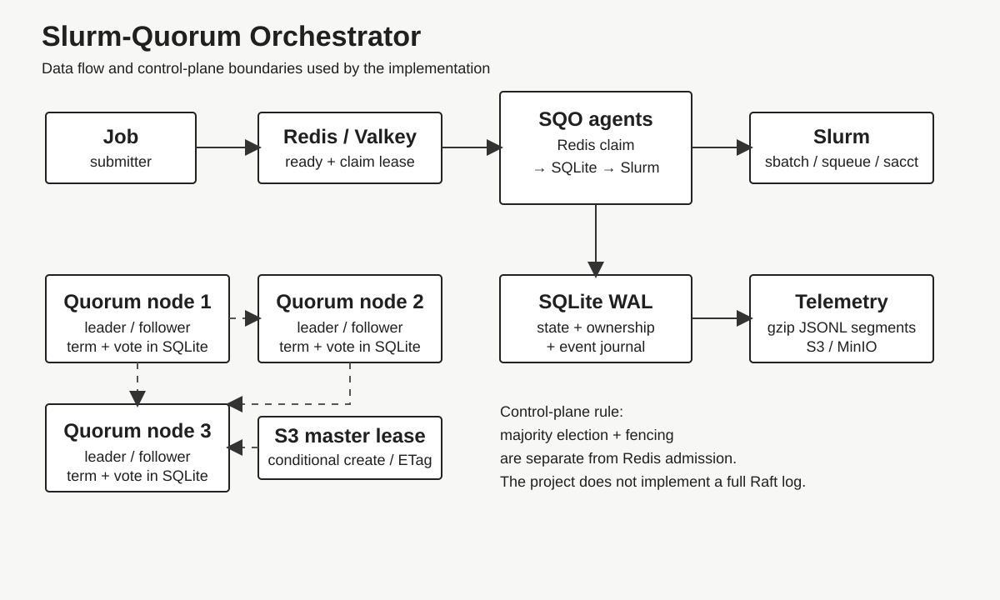
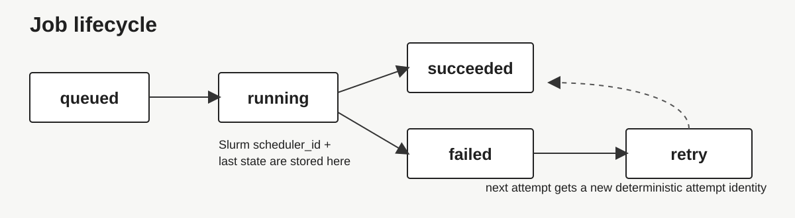
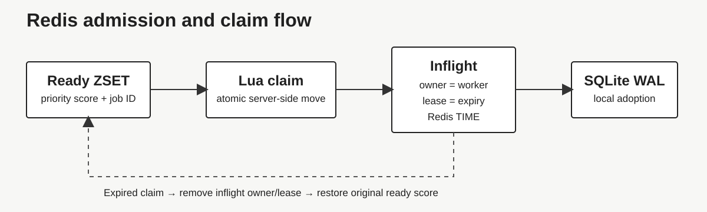
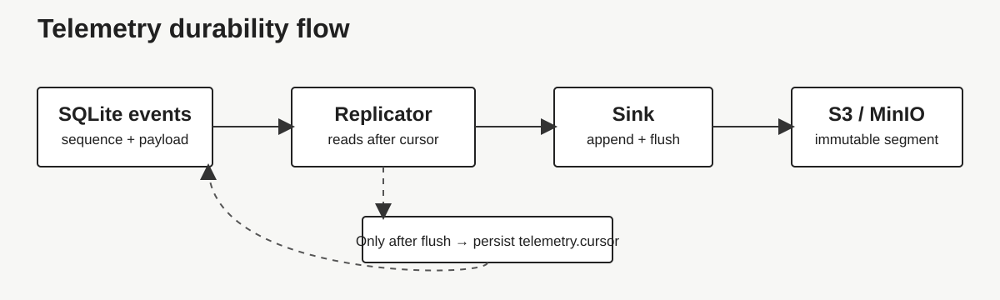
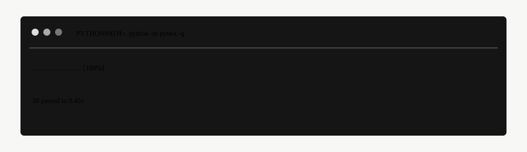
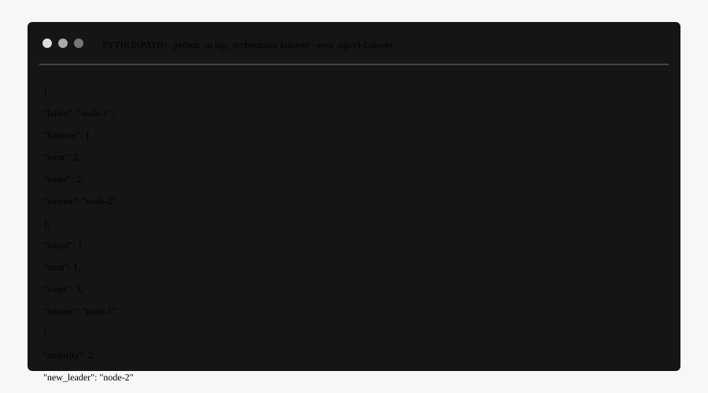
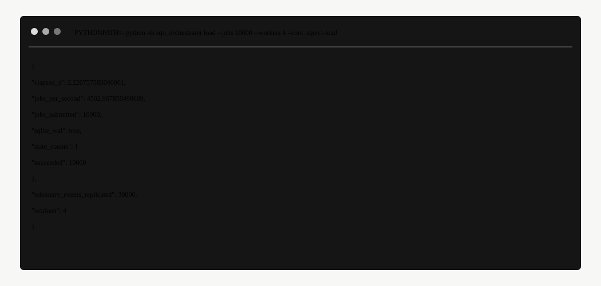
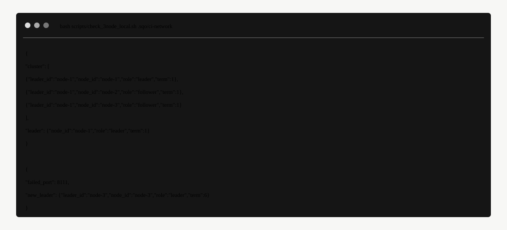

# Slurm-Quorum Orchestrator

A small control plane for running GPU workloads through Redis and Slurm while keeping job state locally durable and coordinating a three-node master election.

The project is implemented in the `sqo_orchestrator/` package. The surrounding repository contains inherited/vendor material from the original project context; the SQO package is deliberately self-contained so it can be installed and run without installing the repository root as a whole.

## What is in the project

| Component | Purpose | Local dependency | Production dependency |
| --- | --- | --- | --- |
| Redis queue | Shared admission queue, priority ordering, claim leases | Redis or Docker | Redis / Valkey |
| SQLite WAL | Node-local job journal and ownership fencing | Built into Python | Local persistent disk |
| Quorum service | Three-node leader election and heartbeat transport | Python HTTP server | Three reachable nodes + S3 lease |
| Slurm agent | Submit, reconcile, retry and recover jobs | Optional dry-run | Slurm `sbatch`, `squeue`, `sacct` |
| Telemetry | Append-only event export | Local files | S3-compatible object storage |

The control plane is intentionally separate from the Slurm scheduler. It does not replace Slurm, and the embedded quorum code is the leader-election/heartbeat portion needed by this project rather than a complete Raft log-replication implementation.

## First run

### Requirements

For the local project checks:

- Python 3.11 or newer
- Git
- Bash on Linux, macOS, or WSL

Redis is **not required** for the local failover, WAL, or throughput demonstrations.

For the distributed queue and Slurm path, also install Redis/Valkey. For the Docker lab, install Docker with the Compose plugin. For a real scheduler run, the machine running the agent must have `sbatch`, `squeue`, and `sacct` available.

### Values to provide for a real deployment

The repository is complete for local and container execution. A real cluster deployment still needs environment-specific values:

| Value | Where it is used |
| --- | --- |
| Redis/Valkey address and credentials | Shared job admission |
| Three node addresses and unique node IDs | Quorum service |
| S3 bucket, region and AWS role/credentials | Master fencing and telemetry |
| Slurm partition and site-specific QoS/constraints | Scheduler submission |
| Persistent filesystem locations | SQLite WAL and service state |

These values remain placeholders in `configs/` and `deploy/`. They are the only deployment inputs that cannot be inferred from source code.

### Option A — one command

From the repository root:

```bash
bash scripts/quickstart.sh
```

This creates `.venv/` when needed, installs the SQO package with its test dependencies, runs the test suite, runs the quorum failover demonstration, runs a 1,000-job local WAL load, and runs the three-process network failover smoke test.

### Option B — manual setup

```bash
python3 -m venv .venv
source .venv/bin/activate

python -m pip install --upgrade pip
python -m pip install -e "./sqo_orchestrator[test]"
```

The package installs a normal `sqo` command:

```bash
sqo --help
```

The module form remains available:

```bash
python -m sqo_orchestrator --help
```

On Windows, the Python commands above work in PowerShell; the Bash scripts can be run from WSL.

## Verify the installation

Run the same checks used by the repository CI job:

```bash
python -m pytest -q
python -m py_compile sqo_orchestrator/*.py scripts/*.py

bash scripts/check_3node_local.sh .sqo/network-check
```

The local checks create their files below `.sqo/`. That directory is disposable and should not be committed.

## Local quorum failover

The smallest demonstration does not require Redis or Slurm:

```bash
sqo failover --root .sqo/failover
```

A normal result contains:

```json
{
  "failed": "node-1",
  "failover": {
    "term": 2,
    "votes": 2,
    "winner": "node-2"
  },
  "majority": 2,
  "new_leader": "node-2"
}
```

The implementation stores the current term and vote in each node's SQLite database. A three-node cluster therefore requires two votes for a leader.

## Three-node network mode

For an actual three-process local network test:

```bash
bash scripts/check_3node_local.sh .sqo/network
```

The script:

1. starts three HTTP quorum nodes on ports 8111, 8112 and 8113;
2. waits for exactly one leader;
3. terminates the elected leader;
4. waits for a different leader on the remaining two nodes; and
5. exits non-zero if the election or failover does not converge.

To keep the three processes running instead of using the smoke test:

```bash
bash scripts/start_3node_local.sh .sqo/cluster
```

In another terminal:

```bash
curl http://127.0.0.1:8101/health
curl http://127.0.0.1:8102/health
curl http://127.0.0.1:8103/health
```

Each response contains the node ID, role, current term and known leader.

The local cluster uses a file-based lease. That lease is suitable for a single-machine demonstration only. In a multi-machine deployment, use the S3 lease described below.

## Local WAL throughput test

The project includes a synthetic throughput command:

```bash
sqo load --jobs 10000 --workers 4 --root .sqo/load
```

For the larger resume-oriented demonstration:

```bash
bash scripts/benchmark_60k.sh 60000 8
```

This test exercises SQLite WAL, short write transactions, worker ownership checks, and telemetry replication. It is a local synthetic benchmark. It is **not** a substitute for a production DGX workload record.

## Redis admission queue

Start Redis:

```bash
redis-server
```

Then submit a job:

```bash
python scripts/enqueue_job.py \
  --redis-url redis://127.0.0.1:6379/0 \
  --queue gpu \
  --priority 10 \
  --gpus 2 \
  --gpu-type h100 \
  --cpus 8 \
  --memory-mb 32768 \
  --partition dgx-h100 \
  --qos research \
  --constraint ram256g \
  --retries 1 \
  -- python train.py --steps 100
```

The command stores the serialized job in Redis and places its ID in a queue-specific priority sorted set.

Claims are performed by a Redis Lua script. A claim moves one job from the ready set into an inflight owner record and assigns a lease expiry using Redis server time. A worker can renew its own lease, and another worker can return an expired claim to the ready queue.

## Slurm agent

The agent bridges Redis claims into the local SQLite journal and then to Slurm.

For a safe first run, use the dry-run mode:

```bash
python scripts/run_slurm_agent.py \
  --redis-url redis://127.0.0.1:6379/0 \
  --queue gpu \
  --partition dgx \
  --worker-id sqo-worker-1 \
  --dry-run
```

For a real Slurm cluster, omit `--dry-run`:

```bash
python scripts/run_slurm_agent.py \
  --redis-url redis://redis.example:6379/0 \
  --queue gpu \
  --partition dgx \
  --worker-id sqo-worker-1
```

The production client uses:

- `sbatch --parsable` for submission;
- `squeue` for live state;
- `sacct` for accounting after a job leaves the live queue; and
- `scancel` for cleanup when SQO loses ownership before a scheduler ID can be recorded.

Every attempt has deterministic SQO identity in the Slurm job name/comment. This is used to avoid treating a late or duplicated submission as a new independent job.

### Direct Slurm smoke test

When connected to a real Slurm cluster:

```bash
python scripts/check_slurm_cluster.py --partition dgx
```

The smoke test submits a small job that prints `SQO_SLURM_SMOKE_OK`, waits for the terminal state, and checks for a successful exit code.

## Docker Compose lab

The repository contains a complete local lab with:

- Redis with AOF enabled;
- LocalStack as the local S3 API;
- three SQO quorum nodes;
- one SQO Redis-to-Slurm agent in dry-run mode.

Start it with:

```bash
docker compose -f deploy/docker-compose.sqo.yml up -d --build
```

Or run the repository smoke script:

```bash
bash scripts/demo_compose.sh
```

Check the quorum nodes:

```bash
curl http://127.0.0.1:8101/health
curl http://127.0.0.1:8102/health
curl http://127.0.0.1:8103/health
```

Submit a compose smoke job:

```bash
docker compose -f deploy/docker-compose.sqo.yml run --rm sqo-agent \
  python /app/scripts/enqueue_job.py \
  --redis-url redis://redis:6379/0 \
  --queue gpu \
  --namespace sqo \
  --job-id compose-smoke \
  -- python -c 'print("SQO_COMPOSE_SMOKE_OK")'
```

Stop the lab:

```bash
docker compose -f deploy/docker-compose.sqo.yml down -v --remove-orphans
```

The Compose lab uses LocalStack for the S3 API and Slurm dry-run mode. It validates queue admission, SQLite WAL state, S3 fencing, telemetry upload and agent reconciliation without pretending that a Slurm controller exists inside the Compose network.

## S3 fencing and telemetry

For production-style fencing, each quorum node uses a shared S3 object as the master lease.

The acquisition path uses conditional object creation. Renewal and release are protected by the current object ETag. Expired takeover reads the lease and conditionally removes the previous owner before attempting a fresh conditional create.

Create or select a private S3 bucket, then adapt:

```text
deploy/aws/sqo-s3-iam-policy.json
deploy/aws/sqo-bucket-policy.example.json
```

The IAM policy is intentionally limited to the lock and telemetry prefixes. Replace `YOUR_BUCKET` before use.

Start each quorum node with the same bucket and prefix but a different node ID and bind address:

```bash
python -m sqo_orchestrator serve \
  --bind 10.0.0.11:8101 \
  --peers '{"node-2":"http://10.0.0.12:8102","node-3":"http://10.0.0.13:8103"}' \
  --root /var/lib/slurm-quorum/node-1 \
  --s3-bucket YOUR_BUCKET \
  --s3-prefix slurm-quorum \
  --s3-region ap-south-1
```

Repeat on nodes 2 and 3 with their own node ID and bind address.

For an S3-compatible endpoint such as MinIO, add:

```bash
--s3-endpoint-url http://minio:9000 --s3-force-path-style
```

The host clocks used to calculate lease expiry must be kept synchronized in a real deployment.

## Production topology



A typical deployment separates shared admission, local durable state, scheduling, and the quorum lease:

| Layer | Responsibility |
| --- | --- |
| Submitter | Creates `JobSpec` records and enqueues them |
| Redis / Valkey | Shared ready queue and worker claim leases |
| SQO agent | Adopts the Redis claim into node-local SQLite and talks to Slurm |
| SQLite WAL | Durable job state, ownership and event journal |
| Slurm | Actual batch scheduling and execution |
| Quorum nodes | Leader election and master fencing |
| S3 / MinIO | Shared master lease and asynchronous telemetry |

The quorum service and the Redis worker pool are separate concerns. Quorum provides master election/fencing; Redis provides distributed job admission and worker claim leases.

## Data model

The node-local SQLite database contains:

| Table | Role |
| --- | --- |
| `jobs` | Current job state, ownership, attempts, scheduler ID and Slurm status |
| `events` | Append-only event journal with monotonically increasing sequence numbers |
| `meta` | Persistent term/vote and telemetry cursor information |

A job moves through:



```text
queued -> running -> succeeded
                  \-> failed
                  \-> retry -> running
```

A Slurm-backed job additionally records its scheduler ID and the last observed Slurm state/exit code.

## Redis claim flow



A Redis claim is a lease, not the source of durable job state. Once the claim is adopted, SQLite WAL becomes the local execution journal. If a worker disappears before acknowledgement, the Redis lease can expire and another worker can take the job.

## Telemetry

Telemetry is produced from the SQLite event journal rather than from an independent best-effort stream.

The replicator:

1. reads events after its durable sequence cursor;
2. appends them to the configured sink;
3. flushes the sink; and only then
4. advances the cursor in SQLite.

The S3 sink writes immutable gzip-compressed JSONL segments using deterministic sequence ranges and conditional object creation. Segments are namespaced by node so that each node's SQLite sequence numbers cannot collide in a shared bucket.



## Repository layout

| Path | Description |
| --- | --- |
| `sqo_orchestrator/` | Installable SQO package |
| `tests/` | Unit and integration tests |
| `scripts/` | Local demos, smoke tests, job submission and agent runners |
| `configs/` | Example environment/configuration files |
| `deploy/` | Docker, systemd and AWS deployment material |
| `docs/SQO_ARCHITECTURE.md` | Architecture notes |
| `RESUME_EVIDENCE.md` | Evidence boundaries for resume claims |
| `SLURM_QUORUM_ORCHESTRATOR.md` | Project-specific implementation summary |

## Configuration

The example files are:

```text
configs/sqo.env.example
configs/slurm_quorum.toml.example
```

The command-line tools accept the important settings directly, which makes the examples easy to translate into systemd, containers or another process manager.

For a systemd deployment, adapt:

```text
deploy/systemd/sqo-agent.service
```

Do not copy the example environment file unchanged into production; replace the placeholder bucket and cluster values.

## Security and deployment notes

The repository is intended to run inside a trusted cluster network. The quorum HTTP endpoints do not provide TLS or application-level authentication themselves. Put them on a private network or behind the site's normal authenticated transport before exposing them outside the cluster.

Use a dedicated Redis/Valkey instance or authenticated/private network in production. The sample commands assume a reachable Redis server and do not configure Redis ACLs.

For AWS, give the runtime identity only the S3 permissions it needs. Review the example bucket policy before applying it to an existing bucket.

## Troubleshooting

### `sqo: command not found`

Activate the virtual environment and install the package:

```bash
source .venv/bin/activate
python -m pip install -e "./sqo_orchestrator"
```

### `No module named sqo_orchestrator`

Run commands from the repository root after installing the package, or use:

```bash
PYTHONPATH=. python -m sqo_orchestrator --help
```

### Redis connection errors

Start Redis:

```bash
redis-server
```

or use the Redis service in the Compose lab.

### Slurm command not found

A real submission needs `sbatch`, `squeue`, and `sacct`. Use `--dry-run` for local testing when a Slurm controller is not available.

### S3 access denied

Check the bucket name, AWS credentials/role, region, lock prefix, telemetry prefix, and the example IAM policy. For MinIO or another S3-compatible service, also set the endpoint URL and path-style addressing.

### Port 8101/8102/8103 is already in use

Stop the existing local cluster processes or change the bind addresses in your own launch command. The supplied smoke script uses those ports deliberately so the three-node check is reproducible.

## Verified repository evidence

The repository's latest completed green control-plane run recorded the following observed results; newer workflow runs also exercise fresh package installation and the Docker Compose integration path:


| Check | Result |
| --- | --- |
| Python tests | 28 passed in 0.57 s |
| Python compilation | Passed |
| SQO shell syntax checks | Passed |
| Docker Compose configuration | Passed |
| Local quorum failover | Passed |
| 10,000-job SQLite-WAL load | 10,000 succeeded, 30,000 telemetry events |
| Three-process network failover | node-1 failed; node-3 became leader |

The 10,000-job run reported approximately 4,480 jobs/s on the CI runner. Earlier development runs also recorded a local 60,000-job synthetic run at about 9.23K jobs/s. These are development/CI measurements, not production DGX throughput claims.

The current repository deliberately does not claim a live AWS bucket result or a live DGX/Slurm production workload record when those environments are not available.

## Verified snapshots

The following images reproduce exact output captured from the CI run above. They are kept with the repository so that the README documents observed behavior rather than simulated UI.

### Test suite



### Local quorum failover



### 10,000-job load test



### Three-node network failover



## Further reading

- [Architecture notes](docs/SQO_ARCHITECTURE.md)
- [Deployment notes](deploy/README.md)
- [Resume evidence](RESUME_EVIDENCE.md)
- [Project implementation summary](SLURM_QUORUM_ORCHESTRATOR.md)

## License

The repository's existing LICENSE file applies to the surrounding repository. The SQO package did not replace or relicense the inherited project material.
