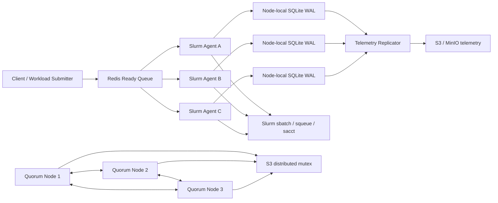

# SQO Architecture

## Responsibilities

Redis is the shared admission plane. A Lua claim atomically moves a job from the ready set to an inflight set and creates a server-clock-based lease. Expired claims can be returned to the ready set for takeover.

SQLite WAL is the node-local execution journal. Claim, heartbeat, scheduler ID, terminal state, retry state, and telemetry events are committed locally with short transactions.

The three quorum nodes maintain leader terms and votes. A leader must also hold the S3 fencing lease before it is considered the active master. The fencing token and term provide the control-plane boundary; the implementation is intentionally an election/heartbeat subset rather than a full replicated Raft state machine.

Slurm is the external scheduler. SQO submits deterministic job names/comments, uses squeue for live state, and uses sacct for accounting after jobs leave the live queue.

Telemetry is at-least-once and crash-deduplicable. WAL sequence ranges produce deterministic S3 segment keys, and the local cursor advances only after the sink flush succeeds.